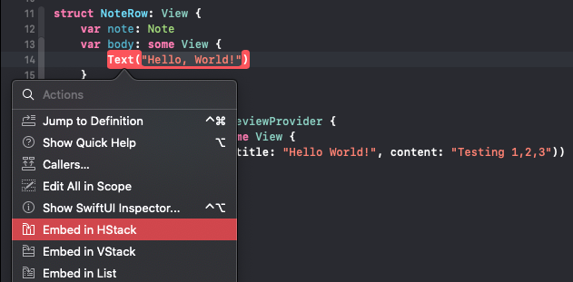
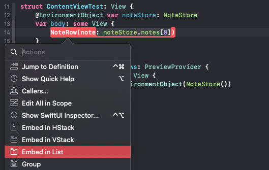
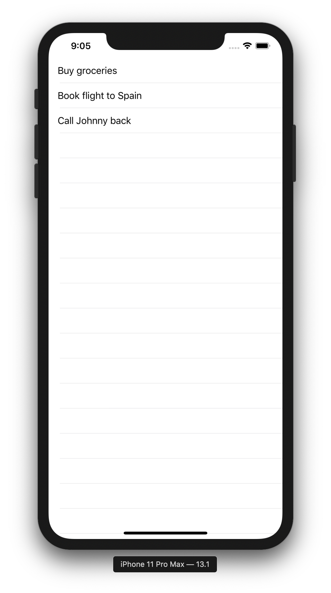
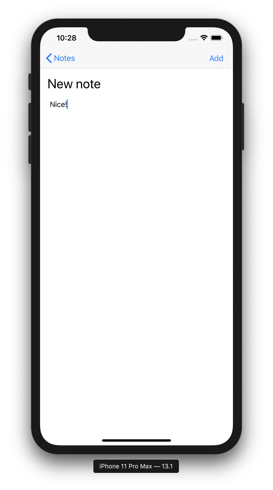
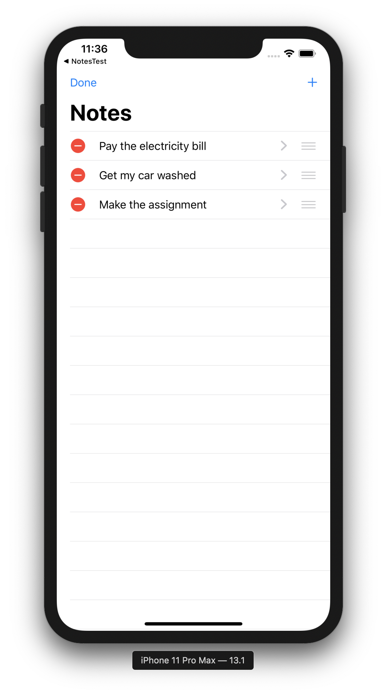
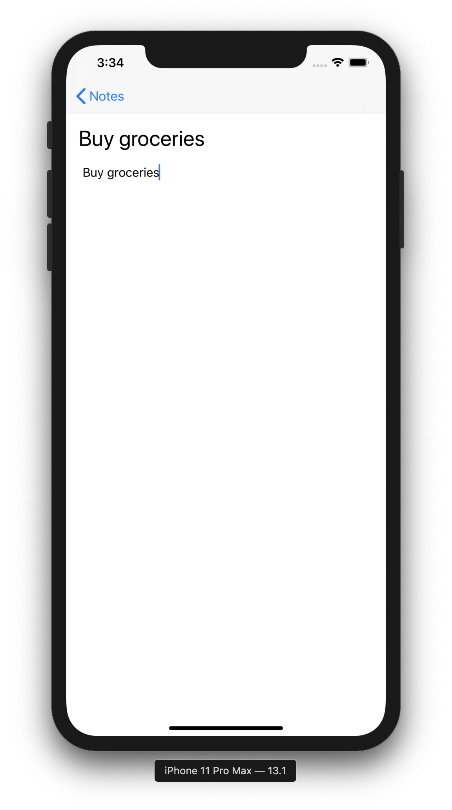

# Step By Step Instructions

SwiftUI is a **declarative** framework for building applications for Apple devices. This means that instead of using Storyboards or programmatically generating your interface, you can use the simplicity of the SwiftUI framework.

## Initial Project Setup

1. Open Terminal, and navigate to the directory in which you want to save this project
2. Run the following command in Terminal: `git clone <INSERT GIT LINK HERE>`
    * This will clone our starter project into your file system
3. Navigate into the newly created folder using the following command: `cd NotesUI`
4. Open the starter project in the latest version of Xcode using the command: `xed .`
    * You can also double-click the `Notes.xcodeproj` file in Finder
  
## Setting Up Our Model

A note is going to be what we call a data model or more simply, a model.
A model is a way to structure data, so that you can work inside your app's code and have a type that represents a real-world concept, like a note.

* Go to **Project Navigator (⌘1)** and add a new file to the project
  1. Right-click on the **yellow** Notes folder, and select `New File...`
  2. Use the standard **Swift File** option then hit next
  3. You are going to define a type that will represent a note, so name your file `Note`
  4. Click `Create`
* Next lets organize a bit and create a folder where our Models will live
  * For that you need to make sure that your `Note.swift` is inside the yellow `Notes` folder first
  * If it isn't, drag it there in the **Project Navigator (⌘1)**
* Right-click on `Note.swift` and select **New Group from Selection**
* That will enclose it in a folder, which we can name `Models`

We will be using structures inside `Note.swift` to represent our `Note` model. Add the following code inside of `Note.swift`:

```swift
struct Note {
    var content: String
    var title: String
    let dateCreated = Date()
}
```

> Every note needs a title and content, both of which should be changeable, so a variable (var) of type `String` is the way to go.

So this represents a note, but this app is going to store as many notes as you want. Now you will need a place to keep track of all of those notes and that, too, is going to be a model.

### Creating the NoteStore model

* Create a new Swift file which we will use to declare our `NoteStore` model
    1. Right-click on the Models folder and select `New File...` again
    2. Select **Swift File**
    3. Name the file `NoteStore.swift`

The Notes app is going to have one NoteStore, but you will need to use it across several screens, so NoteStore will be a reference type (class), rather than a struct. Add the following to `NoteStore.swift`:

```swift
import Combine

class NoteStore: ObservableObject {
    @Published var notes = [
        "SES iOS Workshop Notes",
        "SES Android Workshop Notes",
        "Note 3..."
        ].map { Note(content: $0, title: $0) }
}
```

> Here, we created a variable array named `notes` as a property of `NoteStore` and pre-populated it with three Strings. We then used `map` with it's closure syntax to transform our Strings into Notes.
>
> We also imported the **Combine** framework, conformed to the **ObservableObject** protocol, and marked our notes property as **@Published**. This is all so that we can use our `NoteStore` later as an **Environment Object**. Read more about Environment Objects [here](https://www.hackingwithswift.com/quick-start/swiftui/whats-the-difference-between-observedobject-state-and-environmentobject), and read more about Observable Objects [here](https://www.hackingwithswift.com/quick-start/swiftui/observable-objects-environment-objects-and-published).

Now, with our notes model ready we will take advantage of SwiftUI to create an interface. We will be using a List to display the content.

## Displaying Notes Using a List

A **List** is a container which displays your data in a column, with a row for each entry. This is the structure we will use to organize all our notes. Before we dive further into Lists, we need to create a view that will represent each row of our list.

> When using SwiftUI, Apple encourages you to create as many views as you need to keep your code easy to read.

### Creating A Row View

Let's start by quickly orgainzing our folder structure. Make sure you have your **Project Navigator (⌘1)** open.

* Put `ContentView.swift` into a new group, called `Views`
  * We can do this by right-clicking on `ContentView.swift`, and selecting `New Group from Selection`
* Now create a new SwiftUI view called `NoteRow.swift` inside the Views group.
  1. Right-click on the Views folder and select `New File...`
  2. Select **SwiftUI View**
  3. Name the file `NoteRow.swift`
* In the newly created view add `note` as a stored property of `NoteRow`.
* Since we added a new property we now how to upate the previews property of the `NoteRow_Previews` struct.
  * Update the `NoteRow()` initializer in the previews struct to accept note as a parameter like so: `NoteRow(note: Note(title: "Hello World!", content: "Testing 1,2,3"))`

Your `NoteRow.swift` file should now look like this:

```swift
struct NoteRow: View {
    var note: Note
    var body: some View {
        Text("Hello, World!")
    }
}

struct NoteRow_Previews: PreviewProvider {
    static var previews: some View {
        NoteRow(note: Note(title: "Note Title...", content: "Testing 1,2,3"))
    }
}
```

Check out your work in the Canvas to make sure everything is working. You might have to refresh the canvas by pressing the "Resume" button located on the top of the canvas.

> If the Canvas is not open you can use the Option + Command + Return (`⌥ + ⌘ + ↩︎`) shortcut to display it.
>
> You can use the Option + Command + P (`⌥ + ⌘ + P`) shortcut to refresh your canvas view!

#### Building the Row Layout

* Start by embedding the Text view in an `HStack`
  * Command click on the Text view and select the "Embed in HStack" option.



* Modify the Text view to use the `note` property's `title` like so: `Text(note.title)`
* Add a `Spacer` view and another `Text` view below the current Text view
  * Set the last Text view to display the date the note was creating using one of the `Date` formatters provided in the `Utilties.swift` file.
* Finally, add the `padding()` modifier to the entire `HStack`.

Your `HStack` should now look like this:

```swift
HStack {
    Text(note.title)
    Spacer()
    Text(shortDateFormatter.string(from: note.dateCreated))
}.padding()
```

Refresh your canvas (`⌥ + ⌘ + P`) to make sure everything looks right.

#### Customizing the Row Preview

You can customize the returned content from a preview provider to render exactly the previews that are most helpful to you in the Canvas. Let's play around with the `previewLayout()` modifier to create previews that actually look like rows.

* In the `NoteRow_Previews` struct, add the `.previewLayout()` modifier to the `previews` property to set it to a fixed size like so:

```swift
static var previews: some View {
    NoteRow(note: Note(title: "Note Title...", content: "Testing 1,2,3"))
        .previewLayout(.fixed(width: 300, height: 70))
}
```

* Embed the returned row in a `Group`, and add another sample row.
  * Command click on the `NoteRow` and select the "Group" option
* Now add another sample of a `NoteRow()` in the newly created group:

```swift
Group {
    NoteRow(note: Note(title: "Note Title...", content: "Testing 1,2,3"))
        .previewLayout(.fixed(width: 300, height: 70))
    NoteRow(note: Note(title: "2nd Note Title...", content: "Testing 1,2,3"))
        .previewLayout(.fixed(width: 414, height: 70))
}
```

If you refresh your canvas, you should now see two previews of your `NoteRow` view displayed using different sizes.

## Using NoteRow With Our List

In your **Project Navigator (⌘1)** click on `ContentView.swift`

At this point, our list of notes is ready to be displayed, we just need access to our `NoteStore`. Define the following var as the first line in the `ContentView` struct:

```swift
@EnvironmentObject var noteStore: NoteStore
```

> Remember how we made our NoteStore conform to `ObservableObject` before? We did that in order to use the **@EnvironmentObject** attribute here in our `ContentView`. An `EnvironmentObject` is a value that is available via the application itself. This means it’s shared data that every view can read/write if they want to. And because it is shared, there's no need to initialize it within `ContentView`. We'll do that elsewhere.

We're ready to use out newly created `NoteRow`.

1. Replace the default Text view with our newly finished `NoteRow` and pass the initializer a note using our `noteStore`: `NoteRow(note: noteStore.notes[0])`
2. You should get an error in `ContentView_Previews`. This is because you need to provide your preview with the environment variable that we just defined. In order to fix that, replace the `ContentView()` line in your `ContentView_Previews` struct to the following:

```swift
ContentView().environmentObject(NoteStore())
```

Now, everything should compile alright. We'll need to do this for any `View` in which we use the `NoteStore` environment variable.

3. Command-click on `NoteRow()`, and choose `Embed in List`

    

4. Make the List span from `0 ..< 3` and update `NoteRow` to use the provided `item` closure parameter. `ContentView` should now look like this:

```swift
@EnvironmentObject var noteStore: NoteStore

var body: some View {
    List(0 ..< 3) { item in
        NoteRow(note: self.noteStore.notes[item])
    }
}
```

### Creating a Dynamic List with ForEach

When we use `List` or `ForEach` to make dynamic views, SwiftUI needs to know how it can identify each item *uniquely*, otherwise it’s not able to compare view hierarchies to figure out what has changed.

To accomplish this, modify the `Note` structure in `Note.swift` to make it conform to the **Identifiable** protocol, like this:

```swift
struct Note: Identifiable {
    let id = UUID()
    var content: String
    var title: String
    let dateCreated = Date()
}
```

> First, we added **Identifiable** to the list of protocol conformances. **Identifiable** means “this type can be identified uniquely.” The `Identifiable` protocol has only one requirement, which is that there must be a property called `id` that contains a unique identifier. We already added that to our `Note` struct, so we don’t need to do any extra work – our type conforms to **Identifiable**.
>
> Our `id` is a **UUID**, which is short for Universally Unique Identifier. You can read more about that [here](https://developer.apple.com/documentation/foundation/uuid).
>
> Notes are now guaranteed to be uniquely identifiable, and we won't need to tell our `ForEach` loop which property to use for the identifier – it knows there will be a unique `id`. You can read more about this [here](https://www.hackingwithswift.com/quick-start/swiftui/how-to-create-views-in-a-loop-using-foreach).

As a result of this change we can use the following code to display our list of notes. Modify the `List` code in `ContentView.swift` to match the following:

```swift
List {
    ForEach(noteStore.notes) { note in
        NoteRow(note: note)
    }
}
```

### Testing it out, Part 1

Now would be a good time to run the project to make sure everything is working properly. But before we do that, we need to provide our views with the `NoteStore` environment object! This is done via `SceneDelegate.swift`. Open that file, and in the first function, replace `let contentView = ContentView()` with the following:

```swift
let contentView = ContentView().environmentObject(NoteStore())
```

> This will set the `NoteStore` environment object for our `ContentView` (and all of its subviews) to use.

*Now* we can build and run the project. Click the "play" button in the upper left. If everything went well, it should look something like this.



***

### Adding a NavigationView

The List looks *okay*, but it seems a little plain. Most lists in iOS apps will have a navigation bar at their top, so let's add one now.

In `ContentView.swift`, wrap the `List` block in a `NavigationView`, and give the `List` a navigation bar title:

```swift
NavigationView {
    List {
        ForEach(noteStore.notes) { note in
            NoteRow(note: note)
        }
    }
    .navigationBarTitle("Notes")
}
```

### Taking new notes

To add new notes, we will be need a new SwiftUI file called `AddNoteView.swift`.

* Create a new SwiftUI file called `AddNoteView.swift` inside the `Views` group.

Now, add the following vars at the beginning of the `AddNoteView` struct:

```swift
@EnvironmentObject var noteStore: NoteStore
@Environment(\.presentationMode) var presentationMode
@State var title = ""
@State var text = "Enter a note here"
```

> The `noteStore` should look familiar, it's the same **EnvironmentObject** we used before.
>
> You can alt-click on `presentationMode` to see that it's a binding to a presentationMode instance. We'll get into bindings later. However, `@Environment(\.presentationMode) var presentationMode` is very similar to `@EnvironmentObject`, but it is accessing a global environment that is already populated by SwiftUI with system-wide settings. We will use this later to dismiss our view.
>
> The last two variables are marked `@State`. This means that these vars will be stored by SwiftUI in special internal memory. These vars can be bound to `View`s in our `AddNoteView`, and as soon as the value of a `@State` property changes, SwiftUI will rebuild the `View` to accommodate these changes.
>
> This is definitely a complicated topic, so be sure to read more about it [here](https://swiftwithmajid.com/2019/06/12/understanding-property-wrappers-in-swiftui/).

Now, use a TextFiled as its body to start:

```swift
var body: some View {
    TextField("Enter a title here", text: $title)
        .font(.title)
}
```

> A `TextField` allows users to enter text. "Enter a title here" is our placeholder text, and `$title` is a **binding**. A **binding** creates a two-way connection between the `TextView` and the `@State var title`. User interaction with the `TextField` changes the value of `title`, and programmatically changing `title` causes the `TextField` to update its state.
>
> `.font(.title)` styles the font of this `TextField` to that of a title.

However, we need more than a title for our note! Let's also add a `TextView` that will allow our users to enter a note's body, and bind that `TextView` to our `text` state var.

```swift
VStack {
    TextField("Enter a title here", text: $title)
        .font(.title)
    TextView(text: $text)
}
```

> We wrap everything in a `VStack`. As you might have guessed, this allows us to stack views vertically. There is also an `HStack`, for stacking horizontally.
>
> If you're interested in the implementation of the `TextView`, look at `TextView.swift`.

At this point, you can give a new note a title, and a body, but there's still no way to save it! Let's fix that.

```swift
var body: some View {
    VStack {
        TextField("Enter a title here", text: $title)
            .font(.title)
        TextView(text: $text)
    }
    .navigationBarItems(
        trailing: Button("Add") {
            self.noteStore.notes.append(Note(content: self.text, title: self.title))
            self.presentationMode.wrappedValue.dismiss()
        }
        .disabled(text.isEmpty || title.isEmpty))
}
```

There's a bit going on here, so let's break it down.

* We use `navigationBarItems(trailing:)` to add a button to the navigation bar, at the trailing (normally, right) edge
* Our button has the text "Add"
* The `Button`'s closure defines its functionality
  * It adds a new `Note` to the `noteStore` with the given `text` and `title`
  * It also uses the `presentationMode` variable to dismiss the current screen once it saves
* `.disabled(text.isEmpty || title.isEmpty)` disables the "Add" button until the note is non-empty

Nice, let's take care of some final aesthetic changes and be on our way. We'll be adding some padding around our views, and making the nav bar a little smaller.

```swift
var body: some View {
    VStack {
        TextField("Enter a title here", text: $title)
            .font(.title)
        TextView(text: $text)
    }
    .padding()
    .navigationBarTitle("", displayMode: .inline)
    .navigationBarItems(
        trailing: Button("Add") {
            self.noteStore.notes.append(Note(content: self.text, title: self.title))
            self.presentationMode.wrappedValue.dismiss()
        }
        .disabled(text.isEmpty || title.isEmpty))
}
```

### Navigating to our new screen

Now we have a beautiful new view, but no way of accessing it. Let's open up `ContentView.swift` and get to work.

```swift
NavigationView {
    List {
        ForEach(noteStore.notes) { note in
            RowView(note: note)
        }
    }
    .navigationBarTitle("Notes")
    .navigationBarItems(
        trailing:
        NavigationLink(destination: AddNoteView()) {
            Image(systemName: "plus")
        }
    )
}
```

This should look familiar. We're adding another nav bar item, but this time it's a `NavigationLink`.

* A `NavigationLink` is a button that triggers a navigation presentation when pressed
  * Our destination is a new `AddNoteView`
* Our `NavigationLink`'s content is a "+" image

### Testing it out, part 2

Now would be a good time to test our app again! Build and run, and you should be able to add new notes to your list.



***

### Deleting and rearranging notes

What if we mess up while writing one of our notes? Right now, that's it. But it's not hard to fix, all we need to do is tell our List what to do when a user tries to delete an element. Again, we will be modifying `ContentView.swift`.

```swift
NavigationView {
    List {
        ForEach(noteStore.notes) { note in
            Text(note.title)
        }
        .onDelete { atIndexSet in
            self.noteStore.notes.remove(atOffsets: atIndexSet)
        }
    }
    .navigationBarTitle("Notes")
    .navigationBarItems(
        trailing:
        NavigationLink(destination: AddNoteView()) {
            Image(systemName: "plus")
        }
    )
}
```

> When a user swipes from right to left on a row, the `.onDelete` closure will run. We can use it to control how objects should be deleted from a collection. In practice, this is almost exclusively used with `List` and `ForEach`: we create a list of rows that are shown using `ForEach`, then attach `.onDelete` so the user can remove rows.

* The `.onDelete` modifier only exists on `ForEach`, so if we want users to delete items from a list we must put the items inside a `ForEach`
* The closure removes the note at the index that is being deleted
  * Since we modify the `noteStore`, and the `noteStore` is an EnvironmentObject, any views that rely on it will be updated, including the `ContentView`

We can add a similar closure, as well as a leading navigation bar item, to handle editing the list rows.

```swift
NavigationView {
    List {
        ForEach(noteStore.notes) { note in
            RowView(note: note)
        }
        .onDelete { atIndexSet in
            self.noteStore.notes.remove(atOffsets: atIndexSet)
        }
        .onMove { sourceIndices, destinationIndex in
            self.noteStore.notes.move(fromOffsets: sourceIndices, toOffset: destinationIndex)
        }
    }
    .navigationBarTitle("Notes")
    .navigationBarItems(
        leading: EditButton(),
        trailing:
        NavigationLink(destination: AddNoteView()) {
            Image(systemName: "plus")
        }
    )
}
```

* We added a leading `EditButton()` to our navigation bar
  * This is a special kind of `Button` that toggles the edit mode on/off for the current scope, in this case our `List`
  * Edit mode for a list is the state in which you can delete individual items, or rearrange them
* We added the `.onMove` closure that will run whenever a row is moved
  * The closure moves the specified rows from `sourceIndices` to the rows beginning at `destinationIndex`
  * Again, since SwiftUI is watching our state, this change to `noteStore` are reflected in our UI

### Testing it out, part 3

Let's test this out once more. You should finally be able to get rid of your notes!



***

### Editing existing notes

The last major thing we need to take care of is editing the content of existing notes. Right now, if you click on any row in the List, nothing will happen. Let's start by creating a new `View` that will allow us to edit our notes.

1. Create a new SwiftUI file inside of the `Views` group and name it `NoteView.swift`
2. Start by adding the following two variables at the top of the struct

```swift
@EnvironmentObject var noteStore: NoteStore
var note: Note
```

> We already know what our EnvironmentObject is, and the second var should be straightforward. This will hold the `Note` that we are editing.

3. Add the following computed variable below the first two.

```swift
var noteIndex: Int {
    noteStore.notes.firstIndex(where: { $0.id == note.id }) ?? 0
}
```

> This is a little more complicated. Whenever we access `noteIndex`, the code inside will run. This code iterates over the `noteStore.notes` array, and finds the index of the first note that matches the `id` of our `var note`. 
>
> The `??` mean that if this function doesn't find any matching notes, we will return the index 0 instead. Now, this is not be the best idea in a production app, but it will suffice for now.
>
> We'll use this value later on in our view's `body`.

4. Replace the `body` of our `NoteView` with the following code.

```swift
VStack {
    TextField("Enter a title here", text: $noteStore.notes[noteIndex].title)
        .font(.title)
    TextView(text: $noteStore.notes[noteIndex].content)
}
.padding()
.navigationBarTitle("", displayMode: .inline)
```

> Hopefully, this looks familiar. It's basically the same code from our `AddNoteView` minus the navigation bar item.
>
> However, the key difference is that we are binding the `TextField` and the `TextView` to `$noteStore.notes[noteIndex].title`. In `AddNoteView` we bound to String variables so that we could create a new `Note`. Here, we bind directly to an existing note within the `noteStore`, since we want to edit that note. Any changes made in the `TextField` or `TextView` are reflected immediately in the `noteStore`, and elsewhere in the app.

#### Fixing our preview

Your preview for `NoteView` shouldn't work at this point. If you remember from before, we need to give our `NoteView` a `NoteStore` environment variable. However, this view also needs a `Note` to edit. However, that `Note` needs to exist in the `NoteStore` that you provide to the preview. Replace `static var previews` with the following.

```swift
static var previews: some View {
    let noteStore = NoteStore()
    return NoteView(note: noteStore.notes[0]).environmentObject(noteStore)
}
```

> This creates a NoteStore, and passes the first Note at index 0 to the preview. It also sets the evironment object to the same NoteStore.

### Adding Navigation to Our NoteView

Head back to `ContentView.swift` so we can Navigation to our newly crated view.

Inside `ForEach`'s closure, wrap the returned row in a `NavigationLink`, specifying the `NoteView` view as the destination like so:

```swift
ForEach(noteStore.notes) { note in
    NavigationLink(destination: NoteView(note: note)) {
        NoteRow(note: note)
    }
}
```

### Testing it out, part 4

We should be just about good at this point. Build and run your project once more to see if you're able to click on an existing note and edit its contents.



***
