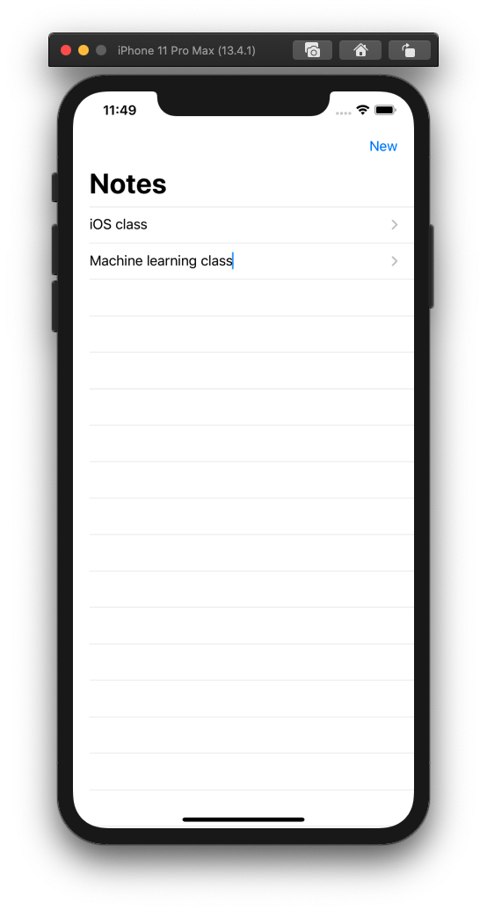
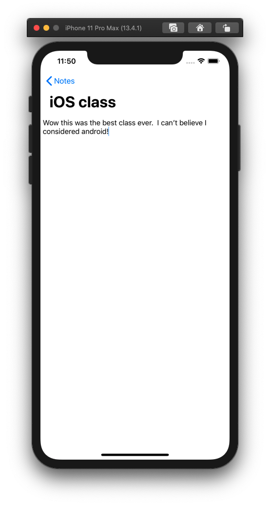

# Step By Step Instructions

SwiftUI is a **declarative** framework for building applications for Apple devices. This means that instead of using Storyboards or programmatically generating your interface, you can use the simplicity of the SwiftUI framework. After years of using UIKit and AppKit to create user interfaces, SwiftUI presents a fresh, new way to create UI for your apps.

## Project Description

Today we will be building an iOS application that will allow Software Engineering Summit participants to take notes on each class throughout the week.  The app will include two main screens: one screen that lists the titles of all notes (summary screen), and one screen that allows the user to view the content of an individual note (detail screen).

The summary screen will allow the user to add a new note, change the title of a note, and navigate to view the note's content.

The detail screen will allow the user to view and edit the selected note's content.





## Initial Project Setup

1. Open Terminal, and navigate to the directory in which you want to save this project
2. Run the following command in Terminal: `git clone https://github.com/C1-SoftwareEngineeringSummit/NotesUI.git`
    * This will clone our starter project into your file system
3. Navigate into the newly created folder using the following command: `cd NotesUI`
4. Navigate to the starter project folder using: `cd NotesUI-Starter`
5. Open the starter project in the latest version of Xcode using the command: `xed .`
    * You can also double-click the `NotesUI-Starter.xcodeproj` file in Finder
  
## Setting Up Our Model

A note is going to be what we call a data model or more simply, a model.
A model is a way to structure data, so that you can work inside your app's code and have a type that represents a real-world concept, like a note.

* Go to **Project Navigator (⌘1)** and add a new file to the project
  1. Right-click on the **yellow** NotesUI-Starter folder, and select `New File...`
  2. Use the standard **Swift File** option then hit next
  3. You are going to define a type that will represent a note, so name your file `Note`
  4. Click `Create`

We will be using structures inside `Note.swift` to represent our `Note` model. Add the following code inside of `Note.swift`:

```swift
import Foundation

struct Note {
    var title: String
    var content: String
}
```

> Every note needs a title which should be changeable, so a variable (var) of type `String` is the way to go.

Now, with our notes model ready, we can start building our UI using SwiftUI. We will start by building the UI for an individual row that will be show on the master screen.  Then, we will use that UI element to show each note in a list.

## Displaying a Note in a Row

A **List** is a container which displays your data in a column, with a row for each entry. This is the structure we will use to organize all our notes. Before we dive further into Lists, we need to create a view that will represent each row of our list.

> When using SwiftUI, Apple encourages you to create as many views as you need to keep your code easy to read.

### Creating A Row View

* Let's start by creating a SwiftUI view called `NoteRow`.
  1. Right-click on the `NotesUI-Starter` folder and select `New File...`
  2. Select the **SwiftUI View** option
  3. Name the file `NoteRow`
* Take a moment to explore this new view. It includes a body View property that contains a single Text property.  Notice it comes with a Canvas to preview your view.
* Let's start with declaring the data that we want to show.  In the newly created view, add a `notes` property of type `[Note]` as a stored property of the `NoteRow` view.  This will be our full list of notes.
* Since we want each row to only show a single note element from the array, add an `index` property of type `[Int]` which specifies which note to show in the row.
* Since we added a new property we now have to update the previews property of the `NoteRow_Previews` struct as well
  * Add an array of `Note`s: `static let notes = [Note(title: "Note title...", content: "Note content...")]`
  * Update the `NoteRow()` initializer in the previews struct to accept notes and index as a parameter like so: `NoteRow(notes: notes, index: 0)`

Your `NoteRow.swift` file should now look like this:

```swift
import SwiftUI

struct NoteRow: View {
    var notes: [Note]
    let index: Int

    var body: some View {
        Text("Hello, World!")
    }
}

struct NoteRow_Previews: PreviewProvider {
    static let notes = [Note(title: "Note title...", content: "Note content...")]
    static var previews: some View {
        NoteRow(notes: notes, index: 0)
    }
}
```

Check out your work in the Canvas to make sure everything is working. You might have to refresh the canvas by pressing the "Resume" button located on the top of the canvas.

> If the Canvas is not open you can use the Option + Command + Return (`⌥ + ⌘ + ↩︎`) shortcut to display it.
>
> 
>
> You can use the Option + Command + P (`⌥ + ⌘ + P`) shortcut to refresh your canvas.

### Building the Row Layout

1. Start by adding a TextField to display a notes title.  Text fields allow users to observe **and** edit text, similar to what you may see when logging into an app:
    <insert text field illustration>
2. When creating the TextField, the first parameter is the default text to show when the TextField is empty, and the second parameter is the String object to maintain the current TextField's content.  We'll use the `notes` property with the index to get a specific `Note`, then use the `title` like so: `TextField("Enter note title", text: notes[index].title)`
3. You'll notice the following error:
`Cannot convert value of type 'String' to expected argument type 'Binding<String>'`
In SwiftUI, a **binding** creates a two-way shared connection between the `TextView` and a property marked with the  `@Binding` property wrapper. User interaction with the `TextField` changes the value of `title`, and programmatically changing `title` causes the `TextField` to update its state.
4. Add the @Binding property wrapper to the notes property, then use the binding by adding a `$` prefix to the `notes` property (`$notes`).

Your `NoteRow` should now look like this:

```swift
struct NoteRow: View {
    @Binding var notes: [Note]
    let index: Int

    var body: some View {
        TextField("take a note", text: $notes[index].title)
    }
}
```

### Fixing and Customizing the Row Preview

First, let's fix the error that is being displayed:
> "Cannot convert value of type '[Note]' to expected argument type 'Binding<[Note]>'"

As the error says, our `NoteRow` now expects a binding.  A simple way to convert a non-binding property to a binding property is to wrap it as a constant:

```swift
NoteRow(notes: .constant(notes), index: 0).previewLayout(.fixed(width: 300, height: 70))
```

You can customize the returned content from a preview provider to render exactly the previews that are most helpful to you in the Canvas. Let's play around with the `previewLayout()` modifier to create previews that actually look like rows.

* In the `NoteRow_Previews` struct, add the `.previewLayout()` modifier to the `previews` property to set it to a fixed size like so:

```swift
struct NoteRow_Previews: PreviewProvider {
    static let notes = [Note(title: "Note title...", content: "Note content...")]
    static var previews: some View {
        NoteRow(notes: .constant(notes), index: 0).previewLayout(.fixed(width: 300, height: 70))
    }
}
```

Previewing your views is a powerful feature as it lets you see all the possibilites your view can live in. You can also use the `.environment` modifer to preview your views in Dark Mode! You can also preview your views in other platforms like the AppleTV or Apple Watch.

It is important to note that anything done in the `PreviewProvider` will not impact how the view is displayed to the user.  It is used for visual testing purposes only.

### Looking Forward: Using `@Binding`

In a future section, we will be creating a parent view that will show multiple `NoteRow`s.  That parent view will be responsible for maintaining an array of notes, and passing them into the notes property we created here in the `NoteRow`.  

This could leave an opportunity for the two arrays (one in the parent view, one in the `NoteRow` child view) to be out-of-sync, since the `NoteRow` will be editing individual `Note` structures, which are pass-by-value.  

However, an additional benefit to using the `@Binding` property wrapper for the `notes` property is that it will be designated as shared between the parent view and our `NoteRow` child view.  Meaning, if the child view changes the value of a `Note`, the parent view's array will be updated as well. 🎉

## Creating our Notes Summary

In your **Project Navigator (⌘1)** click on `ContentView.swift`.  This view will be serve as our note summary screen.

Our goal is to show multiple notes on the note summary screen by using multiple `NoteRow`s, the view we just created.

Let's start by defining our model.  Define an array of notes including two default notes using the following var as the first line in the `ContentView` struct:

```swift
@State var notes: [Note] = [
    Note(title: "iOS is awesome", content: "It's true"),
    Note(title: "SES is awesome", content: "It's true")
]
```
<insert description of state>

We're ready to use our newly created `NoteRow`.

1. Replace the default Text view with our newly finished `NoteRow` and pass the initializer a note using our array:

```swift
struct ContentView: View {
    @State var notes: [Note] = [
        Note(title: "iOS is awesome", content: "It's true"),
        Note(title: "SES is awesome", content: "It's also true")
    ]
    var body: some View {
        NoteRow(notes: $notes, index: 0)
    }
}
```

As expected, only a single NoteRow is shown.  Now we want to show a NoteRow for each Note in the array.

2. Command-click on `NoteRow()`, and choose `Embed in List`

    

4. Make the List span from `0 ..< 2` and update `NoteRow` to use the provided `item` closure parameter. `ContentView` should now look like this:

```swift
var body: some View {
    List(0 ..< 2) { item in
        NoteRow(notes: self.$notes, index: item)
    }
}
```
Here, we are "hard coding" the number of rows we want to show.  Let's instead use the size of our notes array to determine how many `NoteRow`s to create.

Let's try running the application in the iOS simulator.  Click the **Product** dropdown menu, then select **Run**.  Alternatively, click the play button in the very top left of Xcode.

We should be able to observe **and** edit each note's title.

### Creating a Dynamic List

When we use `List` to make dynamic views, SwiftUI needs to know how it can identify each item *uniquely*, otherwise it’s not able to compare view hierarchies to figure out what has changed.

To accomplish this, modify the `Note` structure in `Note.swift` to make it conform to the **Identifiable** protocol, like this:

```swift
import Foundation

struct Note: Identifiable {
    let id = UUID()
    var title: String
    var content: String
}

```

> First, we added **Identifiable** to the list of protocol conformances. **Identifiable** means “this type can be identified uniquely.” The `Identifiable` protocol has only one requirement, which is that there must be a property called `id` that contains a unique identifier. We already added that to our `Note` struct, so we don’t need to do any extra work – our type conforms to **Identifiable**.
>
> Our `id` is a **UUID**, which is short for Universally Unique Identifier. You can read more about that [here](https://developer.apple.com/documentation/foundation/uuid).
>
> Notes are now guaranteed to be uniquely identifiable, and we won't need to tell our `List` loop which property to use for the identifier – it knows there will be a unique `id`. You can read more about this [here](https://www.hackingwithswift.com/quick-start/swiftui/how-to-create-views-in-a-loop-using-foreach).

As a result of this change we can use the following code to display our list of notes. Modify the `List` code in `ContentView.swift` to match the following:

```swift
List(notes.indices, id: \.self) { index in
    NoteRow(notes: self.$notes, index: index)
}
```
<insert explanation of self>

Let's add a third default note to verify that our List is now displaying dynamically based on the number of elements in our `notes` array.

### Adding a NavigationView

The List looks *okay*, but it seems a little plain. Most lists in iOS apps will have a navigation bar at their top, so let's add one now.

In `ContentView.swift`, wrap the `List` block in a `NavigationView`, and give the `List` a navigation bar title:

```swift
NavigationView {
    List(notes.indices, id: \.self) { index in
        NoteRow(notes: self.$notes, index: index)
    }
    .navigationBarTitle("Notes")
}
```
The canvas should now show our "Notes" navigation title. 🎉

## Creating our Note Detail

To this point, we can only observe and edit the title of each note.  We will need to create a new view to see and edit the content of a note.

* Create a new SwiftUI file called `NoteDetail.swift`.

Just like in the NoteRow, we'll add the following two vars at the beginning of the `NoteDetail` struct:

```swift
@Binding var notes: [Note]
let index: Int
```

Now, use a `TextView` (similar to a `TextField`, but supports multiple lines of text) to bind the note's `content` to the body:

```swift
var body: some View {
    TextView(text: $notes[index].content)
}
```

Let's also add the note's title in the navigation bar's title.  Since we won't be editing the title in this view, we use the non-binding `notes` (without the `$` prefix):

```swift
var body: some View {
    TextView(text: $notes[index].content)
        .navigationBarTitle(notes[index].title)
}
```

Lastly, let's setup the `NoteDetail_Previews` similarly to our NoteRow:

```swift
struct NoteDetail_Previews: PreviewProvider {
    static let notes = [Note(title: "Note title...", content: "Note content...")]
    static var previews: some View {
        NoteDetail(notes: .constant(notes), index: 0)
    }
}
```

### Navigating to our new screen

Now we have a beautiful new view, but no way of accessing it. Let's open up `ContentView.swift` and get to work.

Let's wrap our `NoteRow` in a `NavigationLink`.  A `NavigationLink` is a button that triggers a navigation presentation when pressed.

```swift
NavigationLink(destination: NoteDetail(notes: self.$notes, index: index)) {
    NoteRow(notes: self.$notes, index: index)
}
```
We specified that the destination of the link when pressed is our new `NoteDetail`, passing along the `notes` binding and the `index`.

### Testing it out, Part 2

<fill this in>
<youll notice it added the arrows to denote that each cell now navigates to a new screen>

***

### Adding new notes

We can now see and edit each notes title and content.  But how can we add new notes?  We will do so by adding a plus icon button to the top right (called the "trailing") section of our navigation bar.  When tapped, we will add a new note to our notes array.

```swift
// ...
.navigationBarTitle("Notes")
.navigationBarItems(trailing:
    Button("New") {
        self.notes.insert(Note(title: "", content: ""), at: 0)
    }
)
```

Here we add a Button view to the trailing section of our navigation bar.  When tapped, we insert a new note with an empty title and content to the top of the array.

## App Design

SwiftUI allows you to customize any UI element in several ways.  For example, text can be customized with different colors, fonts, backgrounds and apply rotation effects.

Learn more about customizing your application with the following resources:

* [Text](https://www.appcoda.com/learnswiftui/swiftui-text.html)
* [Navigation Bar](https://www.ioscreator.com/tutorials/swiftui-customize-navigation-bar-tutorial)
* [Custom Launch Screen](https://www.tutlane.com/tutorial/ios/ios-launch-screen-splash-screen)
