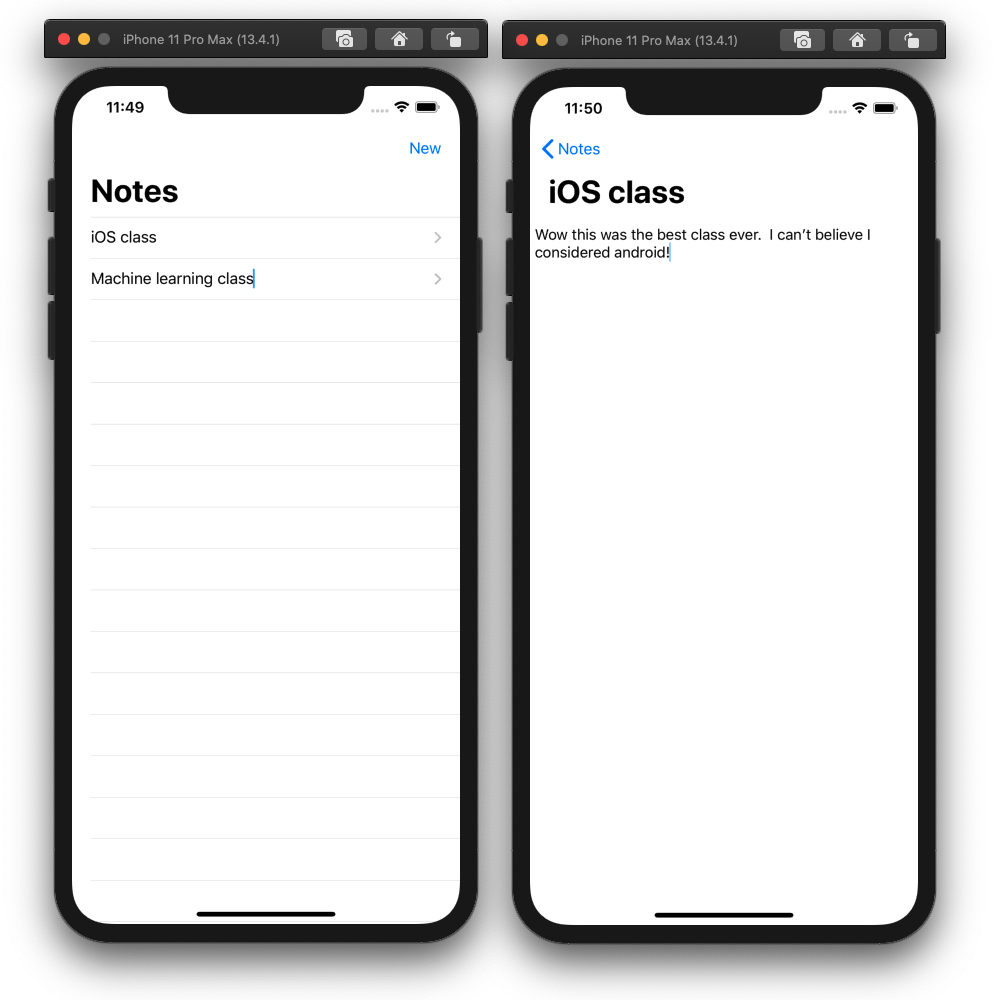
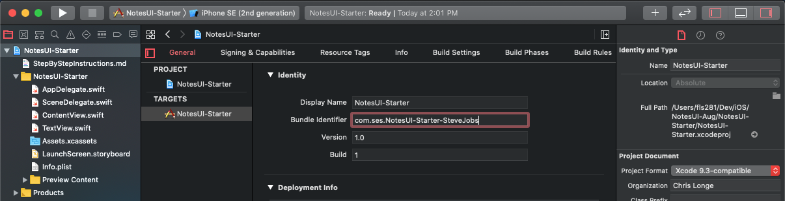
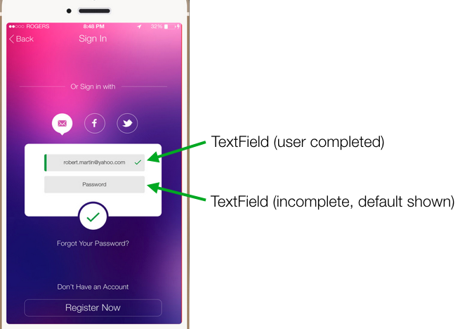
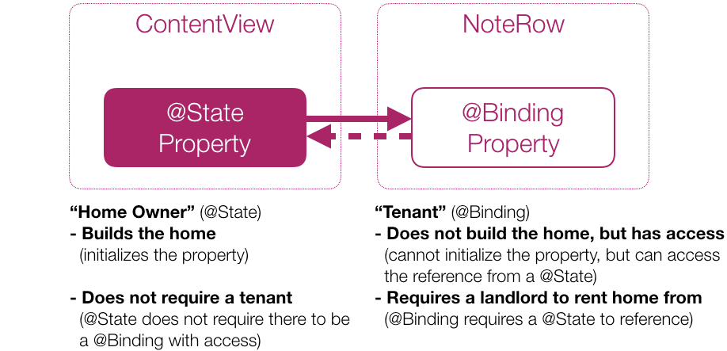
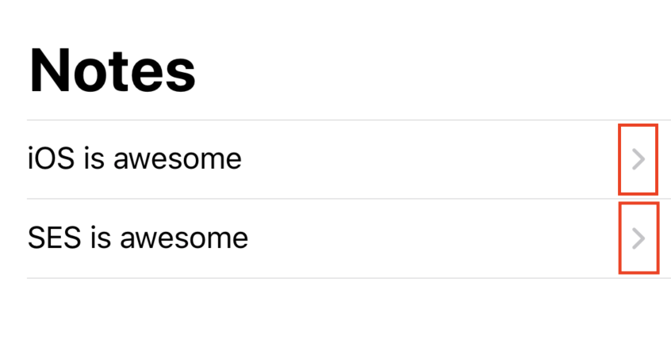

# Step By Step Instructions

SwiftUI is a **declarative** framework for building applications for Apple devices. This means that instead of using Storyboards or programmatically generating your interface, you can use the simplicity of the SwiftUI framework. After years of using UIKit and AppKit to create user interfaces, SwiftUI presents a fresh, new way to create UI for your apps.

## Project Description

Today we will be building an iOS application that will allow Software Engineering Summit participants to take notes on each class throughout the week.  The app will include two main screens: one screen that lists the titles of all notes (summary screen), and one screen that allows the user to view the content of an individual note (detail screen).

The summary screen will allow the user to add a new note, change the title of a note, and navigate to view the note's content.

The detail screen will allow the user to view and edit the selected note's content.



## 1. Initial Project Setup

1. Open Terminal, and navigate to the directory in which you want to save this project
2. Run the following command in Terminal: `git clone https://github.com/C1-SoftwareEngineeringSummit/NotesUI.git`
    * This will clone our starter project into your file system
3. Navigate into the newly created folder using the following command: `cd NotesUI`
4. Navigate to the starter project folder using: `cd NotesUI-Starter`
5. Open the starter project in the latest version of Xcode using the command: `xed .`
    * **NOTE:** You can also double-click the `NotesUI-Starter.xcodeproj` file in Finder
6. Once the project is open in Xcode, click on the top level folder (NotesUI-Starter) then click on "General" settings and then find the "Identity" settings section.
7. Inside Identity settings, modify the "Bundle Identifier" by adding your name to the end of it. For example, change it from `com.ses.NotesUI-Starter-MyName` to `com.ses.NotesUI-Starter-SteveJobs`



## 2. Setting Up Our Model

A `Note` is going to be what we call our data model or more simply, a model. A model is a way to structure data, so that you can work inside your app's code and have a type that represents a real-world concept, like a note. In other words, we will be creating a data structure called `Note`.

* Go to **Project Navigator (⌘1)** and add a new file to the project
  1. Right-click on the **yellow** NotesUI-Starter folder, and select `New File...`
  2. Use the standard **Swift File** option then hit next
  3. You are going to define a type that will represent a note, so name your file `Note`
  4. Click `Create`

We will be using a struct inside `Note.swift` to represent our `Note` model. Add the following code inside of `Note.swift`:

```swift
import Foundation

struct Note {
    var title: String
    var content: String
}
```

> Every note needs a title which should be changeable, so a variable (var) of type `String` is the way to go.

Now, with our notes model ready, we can start building our UI using SwiftUI. We will start by building the UI for an individual row that will be shown on the summary screen.  Then, we will use that UI element to show each note in a list.

## 3. Displaying a Note in a Row

A **List** is a container which displays your data in a column, with a row for each entry. This is the structure we will use to organize all our notes. Before we dive further into Lists, we need to create a view that will represent each row of our list.

> When using SwiftUI, Apple encourages you to create as many views as you need to keep your code easy to read.

### Creating A Row View

* Let's start by creating a SwiftUI view called `NoteRow`.
  1. Right-click on the **yellow** `NotesUI-Starter` folder and select `New File...`
  2. Select the **SwiftUI View** option
  3. Name the file `NoteRow`
  4. Click `Create`
* Take a moment to explore this new view. It includes a property named body of type `View` that contains a single `Text` view.  Notice it comes with a Canvas on the right side of your split-screen to preview your view.
* Let's start with declaring the data that we want to show.  In the newly created view, add a `notes` variable of type `[Note]` as a stored property of the `NoteRow` view.
  * `var notes: [Note]`
* Since we want each row to only show a single note element from the array, add an `index` constant of type `Int` which specifies which note to show in the row.
  * `let index: Int`
* Since we added new properties we now have to update the previews variable of the `NoteRow_Previews` struct as well
  * Add an array of static `Note`'s: `static let notes = [Note(title: "", content: "")]`
  * Update the `NoteRow()` initializer in the previews struct to accept notes and index as a parameter like so: `NoteRow(notes: notes, index: 0)`

Your `NoteRow.swift` file should now look like this:

```swift
import SwiftUI

struct NoteRow: View {
    var notes: [Note]
    let index: Int

    var body: some View {
        Text("Hello, World!")
    }
}

struct NoteRow_Previews: PreviewProvider {
    static let notes = [Note(title: "", content: "")]
    static var previews: some View {
        NoteRow(notes: notes, index: 0)
    }
}
```

Check out your work in the Canvas to make sure everything is working. You might have to refresh the canvas by pressing the "Resume" button located on the top of the canvas. We haven't changed anything in the `body` yet, so all we should see is a blank screen with the greeting "Hello, World!".

> If the Canvas is not open you can use the Option + Command + Return (`⌥ + ⌘ + ↩︎`) shortcut to display it.
>
> 
>
> You can use the Option + Command + P (`⌥ + ⌘ + P`) shortcut to refresh your canvas.

### Building the Row Layout

1. Start by deleting the `Text` view inside the `body` of our `NoteRow`. We will be replacing it with a `TextField`, which we'll use to display a note title.  Text fields allow users to observe **and** edit text, similar to what you may see when logging into an app:



2. When creating the TextField, the first parameter is the default text to show when the TextField is empty, and the second parameter is the String object to maintain the current TextField's content.  We'll use the `notes` property with the index to get a specific `Note`, then use the `title` like so:
    * `TextField("Enter note title", text: notes[index].title)`
3. You'll notice the following error:
    * `Cannot convert value of type 'String' to expected argument type 'Binding<String>'`

> In SwiftUI, a **binding** creates a two-way shared connection between the `TextView` and a property marked with the `@Binding` property wrapper. When a user interacts with the `TextField` and changes the value of `title`, it uses the binding to update the view's state accordingly.

1. Add the `@Binding` property wrapper to the `notes` property, then pass the binding in the `TextField` by adding a `$` prefix to the `notes[index].title` property.

> We used `@Binding` instead of `@State`, because the `TextField` view doesn't own this data—it receives an initial value from its parent view and mutates it. We will be creating the parent view (summary screen) soon.

Your `NoteRow` should now look like this:

```swift
struct NoteRow: View {
    @Binding var notes: [Note]
    let index: Int

    var body: some View {
        TextField("Enter note title", text: $notes[index].title)
    }
}
```

### Fixing and Customizing the Row Preview

First, let's fix the error that is being displayed:
> "Cannot convert value of type '[Note]' to expected argument type 'Binding<[Note]>'"

As the error says, our `NoteRow` now expects a binding.  A simple way to convert a non-binding property to a binding property is to wrap it as a constant:

```swift
NoteRow(notes: .constant(notes), index: 0)
```

> Using `.constant(notes)` in this case is the same as typing `Binding.constant(notes)`. `Binding` can be omitted because Swift can infer it from the context. Swift knows that `NoteRow` needs a `Binding` to an array of `Note`s, and it knows that `Binding.constant()` will create a binding property from our hard-coded `notes` array.

Feel free to refresh your canvas to see the new `TextField`. Remember you can use the shortcut Option + Command + P (⌥ + ⌘ + P)!

### Customizing The Canvas

You can customize the returned content from a preview provider to render exactly the previews that are most helpful to you in the Canvas. Let's play around with the `previewLayout()` modifier to create previews that actually look like rows.

* In the `NoteRow_Previews` struct, add the `.previewLayout()` modifier to the `previews` property to set it to a fixed size like so:

```swift
struct NoteRow_Previews: PreviewProvider {
    static let notes = [Note(title: "Note title...", content: "Note content...")]
    static var previews: some View {
        NoteRow(notes: .constant(notes), index: 0).previewLayout(.fixed(width: 300, height: 70))
    }
}
```

Refresh your canvas again to see the updated preview of our `NoteRow`.

The code in `NoteRow.swift` should now look like this:

```swift
import SwiftUI

struct NoteRow: View {
    @Binding var notes: [Note]
    let index: Int

    var body: some View {
        TextField("Enter note title...", text: $notes[index].title)
    }
}

struct NoteRow_Previews: PreviewProvider {
    static let notes = [Note(title: "", content: "")]
    static var previews: some View {
        NoteRow(notes: .constant(notes), index: 0)
            .previewLayout(.fixed(width: 300, height: 70))
    }
}
```

> Previewing your views is a powerful feature as it lets you see all the possibilites your view can live in. You can also use the `.environment` modifer to preview your views in Dark Mode! You can also preview your views in other platforms like the AppleTV or Apple Watch.
>
> It is important to note that anything done in the `PreviewProvider` will not impact how the view is displayed to the user.  It is used for visual testing purposes only.

### Looking Forward: Using `@Binding`

In a future section, we will be creating a parent view that will show multiple `NoteRow`'s.  That parent view will be responsible for maintaining the array of notes, and passing them into the notes property we created here in the `NoteRow`.

This could leave an opportunity for the two arrays (one in the parent view, one in the `NoteRow` child view) to be out-of-sync, since the `NoteRow` will be editing individual `Note` structures, which are pass-by-value.  

However, an additional benefit to using the `@Binding` property wrapper for the `notes` property is that it will be designated as shared between the parent view and our `NoteRow` child view.  Meaning, if the child view changes the value of a `Note`, the parent view's array will be updated as well. 🎉

## 4. Creating our Notes Summary

In your **Project Navigator (⌘1)** click on `ContentView.swift`.  This view will serve as our note summary screen.

Our goal is to show multiple notes on the note summary screen by using multiple `NoteRow`'s, the view we just created.

Let's start by defining our model.  

1. Create an array of notes including two default notes using the following var as the first line in the `ContentView` struct:

```swift
@State var notes: [Note] = [
    Note(title: "iOS is awesome", content: "It's true"),
    Note(title: "SES is awesome", content: "It's true")
]
```

> The `@State` property wrapper is similar to the `@Binding` property wrapper, allowing a two-way binding between the property and the view.  The difference is that a `@Binding` can't be initialized and must have its reference passed in from a `@State` property in another view.  The `@State` property is considered the "source-of-truth".  In our application, the notes array created in the `ContentView` will be the "source-of-truth" for any view needing access to notes.  In the `NoteRow`, by declaring our notes array as `@Binding`, we are saying that the value will be passed in from another view.

Consider this analogy of `@State` as a home owner and `@Binding` as a tenant:



We're ready to use our newly created `NoteRow`.

2. Replace the default `Text` view with our new `NoteRow`, and pass the `NoteRow` a binding to our `notes` array (with the `$` prefix) and the index of the note to display:

```swift
struct ContentView: View {
    @State var notes: [Note] = [
        Note(title: "iOS is awesome", content: "It's true"),
        Note(title: "SES is awesome", content: "It's also true")
    ]

    var body: some View {
        NoteRow(notes: $notes, index: 0)
    }
}
```

As expected, only a single NoteRow is shown if we refresh the Canvas with Option + Command + P (⌥ + ⌘ + P).  Now we want to show a NoteRow for each Note in the array.

3. Command-click on `NoteRow()`, and choose `Embed in List`

    

4. Make the List span from `0..<2` and update `NoteRow` to use the provided closure parameter, which we can rename from `item` to `index`. Additionally, we will now have to use `self.$notes` in our `NoteRow` initializer, rather than just `$notes`. `ContentView` should now look like this:

```swift
var body: some View {
    List(0..<2) { index in
        NoteRow(notes: self.$notes, index: index)
    }
}
```

Here, we are hard-coding the number of rows we want to show. Next, we will use the size of our `notes` array to determine how many `NoteRow`'s to create.

Let's try running the application in the iOS simulator.  Click the **Product** dropdown menu, then select **Run**.  Alternatively, click the play button in the very top left of Xcode.

We should be able to observe **and** edit each note's title.

### Creating a Dynamic List

The previous `List` approach works.  We loop from the integer `0` to the integer `1`, which creates a `NoteRow` for the note at index `0` and index `1` in the `notes` array.  But what if we have more or less than two notes in the array?  Let's make the `List` more dynamic by creating `NoteRow`'s based on the number of elements in the `notes` array. Modify the `List` like so:

```swift
List(notes.indices, id: \.self) { index in
    NoteRow(notes: self.$notes, index: index)
}
```

The first parameter is the array we want to iterate through.  You'll notice we use `notes.indices` instead of the `notes` array itself.  Because our `NoteRow` expects an `index` parameter, we want to loop through the indices of the `notes` array (ex: `[0, 1, 2, ...]` instead of the actual elements (ex: `[Note, Note, Note, ...]`).

> When we use `List` to make dynamic views, SwiftUI needs to know how it can identify each item uniquely, otherwise it’s not able to compare view hierarchies to figure out what has changed.

The second parameter is an `id`.  `List` expects each element to have a unique identifier.  The argument `\.self` tells `List` that each element is identified by itself.  Remember we are iterating through `notes.indices`, so each element is a unique `Int`.

### Adding a NavigationView

The List looks *okay*, but it seems a little plain. Most lists in iOS apps will have a navigation bar at their top, so let's add one now.

In `ContentView.swift`, wrap the `List` block in a `NavigationView`, and give the `List` a navigation bar title:

```swift
NavigationView {
    List(notes.indices, id: \.self) { index in
        NoteRow(notes: self.$notes, index: index)
    }
    .navigationBarTitle("Notes")
}
```

The code in `ContentView.swift` should now look like this:

```swift
import SwiftUI

struct ContentView: View {
    @State var notes: [Note] = [
        Note(title: "iOS is awesome", content: "It's true"),
        Note(title: "SES is awesome", content: "It's true")
    ]

    var body: some View {
        NavigationView {
            List(notes.indices, id: \.self) { index in
                NoteRow(notes: self.$notes, index: index)
            }
            .navigationBarTitle("Notes")
        }
    }
}

struct ContentView_Previews: PreviewProvider {
    static var previews: some View {
        ContentView()
    }
}
```

The canvas should now show our "Notes" navigation title. 🎉

## 5. Creating our Note Detail

Until now, we could only observe and edit the title of each note.  We will need to create a new view to see and edit the content of a note.

* Create a new SwiftUI file called `NoteDetail.swift`.
  1. Right-click on the **yellow** NotesUI-Starter folder, and select `New File...`
  2. Use the **SwiftUI View** option, then hit next
  3. Name your file `NoteDetail`
  4. Click `Create`


Just like in the `NoteRow`, we'll add the following two properties at the beginning of the `NoteDetail` struct. These properties hold our entire array of `Note`s and the index of the specific `Note` which we will display on this details screen:

```swift
@Binding var notes: [Note]
let index: Int
```


Now, replace the default `Text` in the `body` variable with a `TextView`. A `TextView` is similar to a `TextField`, but it supports multiple lines of text. Use `$` to bind the current note's `content` to the `TextView` in the `body`. This way, whenever a user changes the text in the `TextView`, the corresponding `Note` in our `notes` array will be updated, too:

```swift
var body: some View {
    TextView(text: $notes[index].content)
}
```

Let's also display the current note's `title` in the navigation bar.  Since we won't be editing the title in this `NoteDetail` view, we use the non-binding `notes` (without the `$` prefix):

```swift
var body: some View {
    TextView(text: $notes[index].content)
        .navigationBarTitle(notes[index].title)
}
```

Lastly, let's set up the `NoteDetail_Previews` struct similarly to our `NoteRow`. Notice that this time, we wrapped our `NoteDetail` inside of a `NavigationView`. This is necessary so that we can see the navigation bar in our Canvas:

```swift
struct NoteDetail_Previews: PreviewProvider {
    static let notes = [Note(title: "Note title...", content: "Note content...")]
    static var previews: some View {
        NavigationView {
            NoteDetail(notes: .constant(notes), index: 0)
        }
    }
}
```

Again, if the Canvas is not open you can use the Option + Command + Return (⌥ + ⌘ + ↩︎) shortcut to display it. You can also use the Option + Command + P (⌥ + ⌘ + P) shortcut to refresh your canvas. At this point you should be able to see your `NoteDetail` view in the Canvas!

Your completed `NoteDetail` code should look like this:

```swift
import SwiftUI

struct NoteDetail: View {
    @Binding var notes: [Note]
    let index: Int

    var body: some View {
        TextView(text: $notes[index].content)
            .navigationBarTitle(notes[index].title)
    }
}

struct NoteDetail_Previews: PreviewProvider {
    static let notes = [Note(title: "Note title", content: "some content...")]
    static var previews: some View {
        NavigationView {
            NoteDetail(notes: .constant(notes), index: 0)
        }
    }
}
```

### Navigating to our new screen

Now we have a beautiful new view, but no way of accessing it. Let's open up `ContentView.swift` and get to work.

Inside of the `ContentView`'s `body` variable, let's wrap our `NoteRow` in a `NavigationLink`.  A `NavigationLink` is a button that triggers a navigation presentation when pressed.

```swift
NavigationLink(destination: NoteDetail(notes: self.$notes, index: index)) {
    NoteRow(notes: self.$notes, index: index)
}
```

We specified that the `destination` of the `NavigationLink` is our new `NoteDetail` screen. We passed a binding to the `notes` array and the `index` of our current note to the `NoteDetail` screen so that it can display the correct information.

At this point, our `ContentView` code should look like this:

```swift
import SwiftUI

struct ContentView: View {
    @State var notes: [Note] = [
        Note(title: "iOS is awesome", content: "It's true"),
        Note(title: "SES is awesome", content: "It's true")
    ]

    var body: some View {
        NavigationView {
            List(notes.indices, id: \.self) { index in
                NavigationLink(destination: NoteDetail(notes: self.$notes, index: index)) {
                    NoteRow(notes: self.$notes, index: index)
                }
            }
            .navigationBarTitle("Notes")
        }
    }
}

struct ContentView_Previews: PreviewProvider {
    static var previews: some View {
        ContentView()
    }
}
```

Build the app or refresh the canvas. You should be able to see that each row has been updated with a link indicator, and can now be pressed.



## 6. Adding New Notes

We are now able to view and edit each note's title and content, but how do we go about adding new notes?  We will do so by adding a "+" button to the top right (called the "trailing") section of our navigation bar.  When tapped, we will add a new note to our notes array.  In `ContentView`, add the following code after the `navigationBarTitle` in the `body` variable.

```swift
// ...
.navigationBarTitle("Notes")
.navigationBarItems(trailing:
    Button(action: {
        self.notes.insert(Note(title: "", content: ""), at: 0)
    }) {
        Image(systemName: "plus")
    }
)
```

This adds a `Button` to the trailing section of our navigation bar. The `Button` executes its `action` when it is tapped. In this case, the action is to insert a new `Note` with an empty title and content to the beginning of the `notes` array. The trailing closure on the `Button` tells us that this button will use the default "+" `Image`.

Your `ContentView` code should now look like this:

```swift
import SwiftUI

struct ContentView: View {
    @State var notes: [Note] = [
        Note(title: "iOS is awesome", content: "It's true"),
        Note(title: "SES is awesome", content: "It's true")
    ]

    var body: some View {
        NavigationView {
            List(notes.indices, id: \.self) { index in
                NavigationLink(destination: NoteDetail(notes: self.$notes, index: index)) {
                    NoteRow(notes: self.$notes, index: index)
                }
            }
            .navigationBarTitle("Notes")
            .navigationBarItems(trailing:
                Button(action: {
                    self.notes.insert(Note(title: "", content: ""), at: 0)
                }) {
                    Image(systemName: "plus")
                }
            )
        }
    }
}

struct ContentView_Previews: PreviewProvider {
    static var previews: some View {
        ContentView()
    }
}
```

At this point, run the app once more. We should be able to edit each note's title, navigate to each note's detail screen and edit the contents, and also add new notes!

## Conclusion

Congratulations! You now have a functioning iOS app written in SwiftUI.

Check out the [README](../README.md) for bonus functionality that you can add after completing this workshop.
